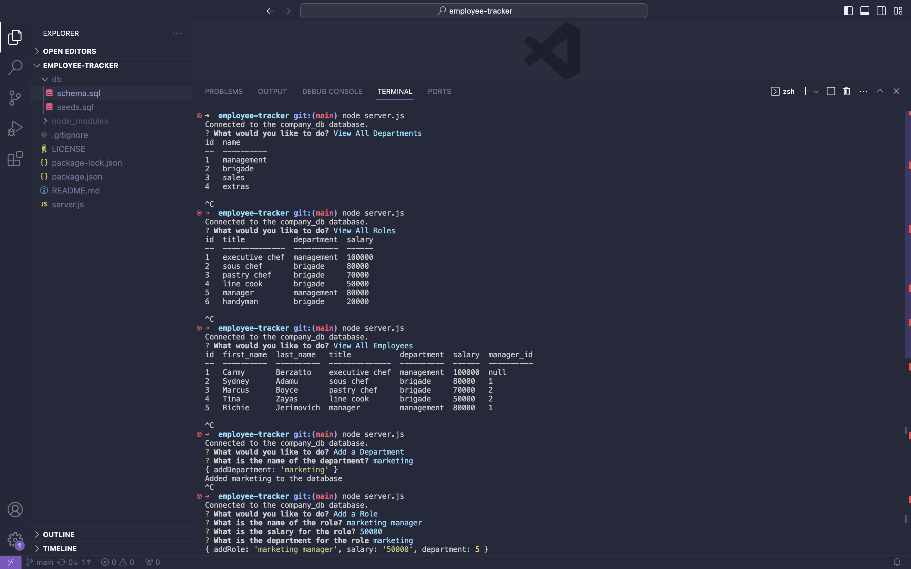

# employee-tracker

## Description
Employee-Tracker is a command-line application for managing a company's employee database, using Node.js, Inquirer, and MySQL.

## Usage

Watch the walkthrough video [here]().

## License
This app is covered under the MIT license.